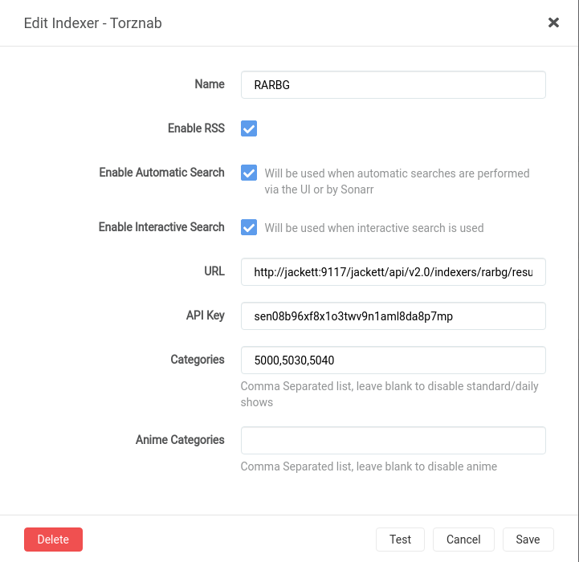

# Jackett-Sync [](https://travis-ci.com/lmarianski/jackett-sync)

A quick & dirty extensible Jackett-to-Sonarr/Radarr/Lidarr/Whatever indexer synchronizer written in Node.js. PRs are welcome!

## Install
### NPM
```
npm i -g jackett-sync
```
### Docker
An image is available at [`m00nwatcher/jackett-sync`](https://hub.docker.com/repository/docker/m00nwatcher/jackett-sync)

docker-compose.yml example:
```yml
version: "3"

services:
  jackett-sync:
    image: m00nwatcher/jackett-sync
    environment:
      URL: http://jackett:9117
      APIKEY: 
      # ALTURL: http://jackett:9117 # If running with network_mode: host, like in ./docker/docker-compose.yml
      SONARR_URL: http://sonarr:8989
      SONARR_KEY: 
      RADARR_URL: http://radarr:7878
      RADARR_KEY: 
      LIDARR_URL: http://lidarr:8686
      LIDARR_KEY:     
# ... Lidarr, Sonarr, etc. config
```
Right now it just runs the script in a loop, but you should be able to adjust `./docker/cron` to change frequency.

## Usage
Services declare required and optional parameters in the `services.js` file, you can supply them on the command line with `--<param name> <value>`. If the correct required params are detected, the line "Found config for \<service name>" will appear in the console. You can view all options with `--help`

# Example
Example in a docker enviroment (jackett-sync running on host), badasstorrents was down at the time
```
$ jackett-sync --url http://127.0.0.1:9117/jackett --apikey sen08b96xf8x1o3twv9n1aml8da8p7mp --alturl http://jackett:9117/jackett --sonarrurl http://127.0.0.1:8989/sonarr --sonarrkey b27b78ff3e994da1b4460f40e576a029 --sonarrcats 5000,5030,5040

Found config for jackett
Found config for sonarr
Adding rarbg, badasstorrents, kickasstorrent, torrentparadise
Added kickasstorrent successfully
Failed to add badasstorrents
Added torrentparadise successfully
Added rarbg successfully
Done
```
One of the created entries:


## Extend the capabilities

### To add a new "indexer source" (e.g. Jackett, NZBHydra)
NOTE: Possible, but not tested as i don't use Usenet/NZBHydra

Edit `services.js`, add a new service with the `get` method, and set the `source` property, and as long as you return an array with indexer objects following the schema described at the top (in the `schema` const variable), it should work!

### To add a new "indexer consumer" (e.g Sonarr, Radarr, Lidarr, LazyLibrarian)
Edit `services.js`, add a new service with the `get` (same as with indexer sources), `add` (consume a singular indexer object and add to the upstream service) and `shouldAdd` (use this to filter out indexers that don't provide the correct categories) methods.
Error handling is very rudimentary to say the least, but its good enough for the time being.

## Usenet support
Theoretically it should work, but as stated earlier untested

## TODO

- [] Add options to change indexer settings (min seeders etc.)
- Other stuff maybe